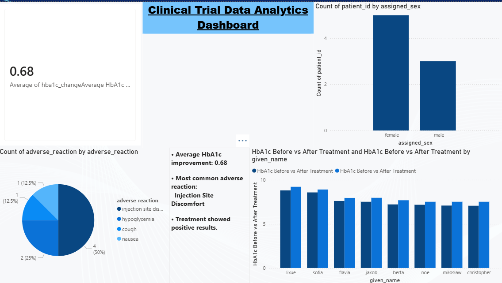

# Clinical Trial Data Analytics Project

## Overview
This project analyzes clinical trial data using Python, Pandas, Excel, and Power BI.

## Tools Used
- Python
- Pandas
- Excel
- Power BI

## Project Tasks
- Data Cleaning
- Data Preprocessing
- Data Merging
- Exploratory Data Analysis (EDA)
- Dashboard Creation

## Key Insights
- Average HbA1c Improvement: 0.68
- Most Common Adverse Reaction: Injection Site Discomfort
- Treatment showed positive outcomes.

## Dashboard
Power BI dashboard created to analyze:
- Patient demographics
- Adverse reactions
- HbA1c improvement
- Treatment effectiveness
- ## Dashboard Preview

